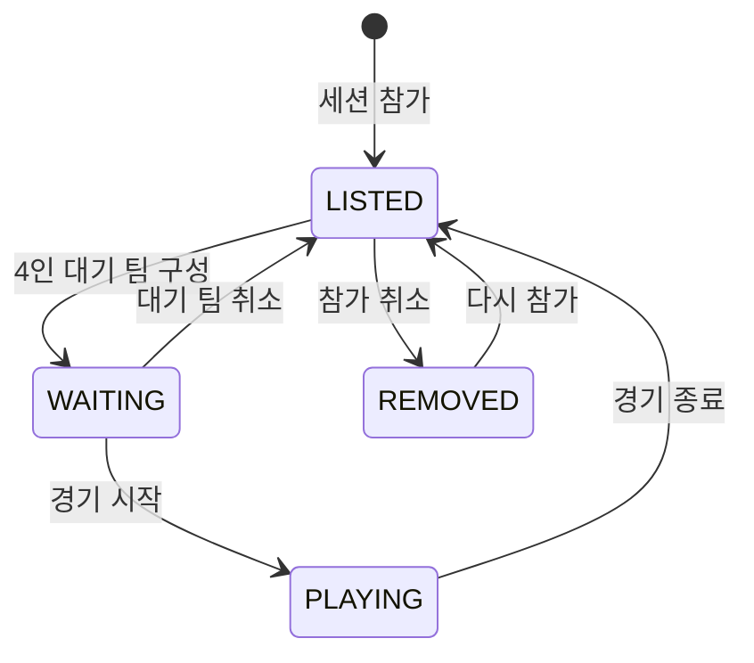
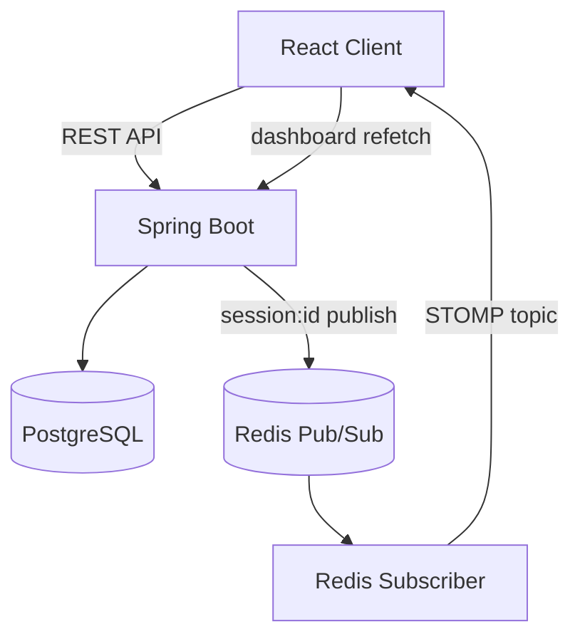
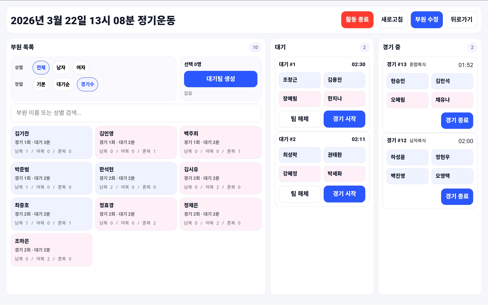
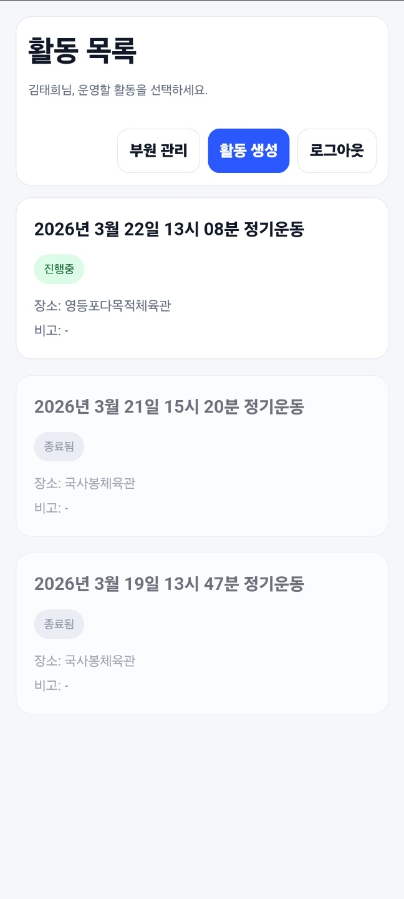

# PLAYCOCK

PLAYCOCK은 배드민턴 동아리의 회원과 운동 세션을 관리하고, 참가자 대기 상태와 경기 진행 상황을 실시간으로 공유하는 운영 서비스입니다.

기존에는 화이트보드와 자석으로 참가자와 코트를 관리해 운영자마다 현재 상태를 다르게 인식하기 쉬웠고, 매 경기마다 4명을 다시 고르는 과정도 반복해야 했습니다. PLAYCOCK은 회원 등록부터 세션 참가, 대기 팀 구성, 경기 시작·종료까지 하나의 흐름으로 연결합니다.

현재 7명의 운영자가 약 60명의 동아리 회원을 관리하는 데 사용하고 있습니다.

> 이 저장소는 기존 백엔드와 프런트엔드 저장소의 이력을 보존해 하나로 합친 통합·문서화 저장소입니다. 원본 저장소의 배포 워크플로는 각 애플리케이션 디렉터리에 남아 있지만, 이 모노레포 기준의 통합 배포는 별도로 구성하지 않았습니다.

## 문서

- [아키텍처와 설계](docs/ARCHITECTURE.md)
- [API 명세](docs/API.md)
- [데이터 모델](docs/DATABASE.md)
- [백엔드 실행 및 구성](backend/README.md)
- [프런트엔드 실행 및 구성](frontend/README.md)

## 핵심 운영 흐름

1. 운영자가 정기 또는 번개 세션을 생성합니다.
2. 회원을 세션 참가자로 추가합니다.
3. 참가자 4명을 선택해 대기 팀을 만듭니다.
4. 대기 팀을 경기로 전환하면 참가자 상태가 `PLAYING`으로 바뀝니다.
5. 경기를 종료하면 경기 횟수를 집계하고 참가자를 다시 대기 명단으로 돌려보냅니다.
6. 진행 중인 경기와 대기 팀이 모두 없어야 세션을 종료할 수 있습니다.



## 주요 기능

### 회원 및 운영자 관리

- 회원 기본 정보, 성별, 급수, 기수, 회원 구분과 활동 여부 관리
- 이름·학교·기수·성별·회원 구분·급수·활동 여부 기반 검색
- 운영자 가입, 로그인, 역할 및 계정 상태 관리
- JWT 기반 인증과 `USER`·`MANAGER`·`ADMIN` 권한 구분

### 세션 및 경기 운영

- 정기 운동과 번개 운동 세션 생성
- 참가자 추가·제외 및 세션별 상태 관리
- 정확히 4명으로 대기 팀 구성
- 참가자의 성별 구성에 따른 남자·여자·혼합 복식 자동 분류
- 경기 종료 시 전체 및 종목별 경기 횟수 갱신
- 대기 팀 또는 진행 중 경기가 남아 있을 때 세션 종료 방지

### 대시보드와 실시간 동기화

- 참가자, 대기 팀, 진행 중 경기 상태를 하나의 대시보드로 제공
- 상태와 경기 횟수, 마지막 경기 시각을 이용한 참가자 정렬
- 상태 변경 시 Redis Pub/Sub으로 세션 이벤트 발행
- STOMP 구독 클라이언트가 이벤트를 받으면 대시보드 전체를 다시 조회
- 이벤트에는 세션 ID만 전달하고 최종 상태는 데이터베이스에서 재조회



## 서비스 화면

### 실시간 경기 운영 대시보드

참가자를 명단·대기 팀·진행 중 경기로 구분해 한 화면에서 확인합니다. 운영자는 성별과 경기 횟수로 참가자를 필터링·정렬하고, 4인 대기 팀 생성부터 경기 시작과 종료까지 같은 화면에서 처리할 수 있습니다.

<p align="center">
  
</p>

### 회원과 운동 세션 관리

회원 원장과 운동 세션을 분리해 관리합니다. 회원의 기본 정보는 계속 유지하고, 운동별 참가 여부와 `LISTED`·`WAITING`·`PLAYING` 상태는 해당 세션 안에서 관리합니다.

<p align="center">
  
  
  
</p>

<p align="center">
  <sub>회원 검색·관리 · 운동 세션 목록 · 세션 참가자 관리</sub>
</p>

## 설계에서 중요하게 본 기준

### 영속 회원과 세션 참가 상태의 분리

`Member`는 이름, 기수, 급수처럼 계속 유지되는 회원 정보를 담당합니다. 반면 `SessionParticipant`는 특정 운동 세션에서의 참가 상태, 경기 횟수, 마지막 경기 시각을 관리합니다. 같은 회원이 여러 세션에 참여해도 각 세션의 운영 상태가 서로 영향을 주지 않습니다.

### 명시적인 상태 전이

참가자 상태를 `LISTED`, `WAITING`, `PLAYING`, `REMOVED`로 구분하고 서비스 계층에서 허용된 전이만 수행합니다. 예를 들어 `LISTED` 참가자만 대기 팀에 들어갈 수 있으며, 네 명이 모두 `WAITING` 상태인 팀만 경기를 시작할 수 있습니다.

### 알림과 데이터 진실의 분리

WebSocket 메시지에 전체 대시보드 데이터를 싣지 않고 변경된 세션 ID만 전달합니다. 클라이언트는 알림을 받은 뒤 REST API를 다시 호출하므로, 화면은 서버와 데이터베이스가 확정한 상태를 기준으로 갱신됩니다.

### 운영 피드백의 빠른 반영

실사용 과정에서 게스트와 정회원 구분, 이름 정렬, 급수 입력, 경기 유형 표시, 대기 시간 계산 문제 등을 발견해 기능과 화면을 조정했습니다. 서비스의 기준을 추측하기보다 실제 운영자의 사용 흐름을 통해 보완했습니다.

## 기술 구성

| 영역 | 기술 |
| --- | --- |
| Backend | Java 17, Spring Boot 3.5, Spring Security, Spring Data JPA |
| Data | PostgreSQL, Redis Pub/Sub |
| Realtime | WebSocket, STOMP |
| Frontend | React 19, TypeScript, Vite, Axios |
| Infra | Docker, Docker Compose, AWS EC2, GHCR, GitHub Actions |
| API Docs | springdoc-openapi, Swagger UI |

## 저장소 구조

```text
playcock-monorepo/
├── backend/                  # Spring Boot API, 도메인 및 실시간 이벤트
├── frontend/                 # React 운영 화면
├── docs/
│   ├── API.md                # REST API와 WebSocket 명세
│   ├── ARCHITECTURE.md       # 모듈, 상태 전이, 동기화 방식
│   ├── DATABASE.md           # 엔티티 관계와 데이터 규칙
│   └── images/               # 서비스 화면 이미지
└── README.md
```

## 빠른 실행

백엔드와 프런트엔드는 각각 실행합니다. 필요한 환경 변수와 주의점은 하위 문서를 확인해 주세요.

```bash
# backend
cd backend
./gradlew clean bootJar
docker compose -f docker-compose-prod.yml up --build

# frontend (새 터미널)
cd frontend
npm ci
npm run dev
```

- 백엔드 상세 설정: [backend/README.md](backend/README.md)
- 프런트엔드 상세 설정: [frontend/README.md](frontend/README.md)

## 현재 공개 저장소에서 확인할 점

- `application.yml`의 기본 활성 프로필은 `local`이지만 `application-local.yml`은 포함되어 있지 않습니다. Docker 실행은 `docker` 프로필을 사용합니다.
- 운영 설정에는 Flyway 의존성과 설정이 있으나, 현재 공개 저장소에는 마이그레이션 SQL이 없습니다. Docker 프로필은 Flyway를 끄고 Hibernate `ddl-auto: update`를 사용합니다.
- 자동화 테스트는 애플리케이션 컨텍스트 테스트 중심으로 제한적입니다.
- WebSocket 연결 인증, 동시 상태 변경 제어, 조회 쿼리 최적화는 추가 보완이 필요합니다.
- 이 모노레포 루트 기준의 CI/CD는 구성하지 않았습니다. 하위 디렉터리의 워크플로 파일은 원본 저장소 이력을 보존하기 위한 것입니다.

## 원본 저장소

- [playcock-backend](https://github.com/kroad0129/playcock-backend)
- [playcock-frontend](https://github.com/kroad0129/playcock-frontend)
