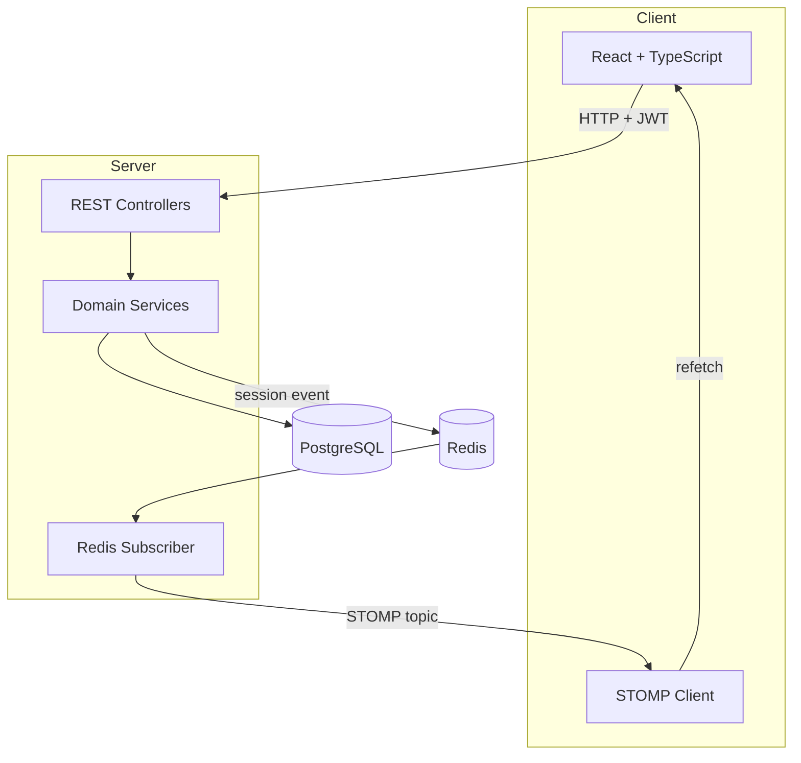
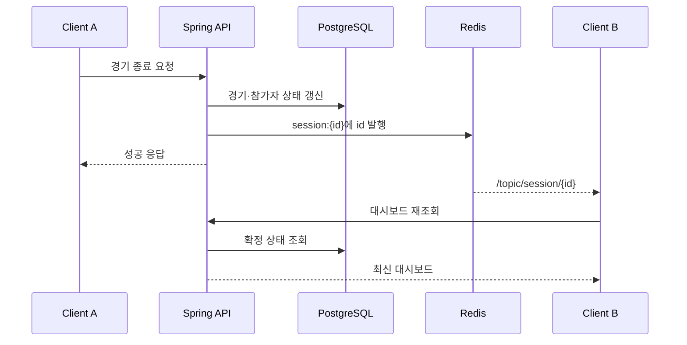

# PLAYCOCK 아키텍처

## 시스템 구성

PLAYCOCK은 React 클라이언트, Spring Boot API, PostgreSQL, Redis로 구성됩니다. 일반 조회와 상태 변경은 REST API로 처리하고, 변경 사실은 Redis Pub/Sub과 STOMP를 거쳐 접속 중인 클라이언트에 알립니다.



## 저장소와 애플리케이션 경계

```text
backend/src/main/java/com/playcock/
├── auth/                    # 로그인
├── user/                    # 운영 사용자와 권한
├── member/                  # 영속 회원 정보
├── session/
│   ├── controller/          # 세션 운영 API
│   ├── domain/              # 세션, 참가자, 대기 팀, 경기
│   ├── dto/                 # 요청과 대시보드 응답
│   ├── repository/          # JPA 저장소
│   └── service/             # 상태 전이 및 운영 규칙
└── global/
    ├── config/              # Security, Redis, WebSocket, Swagger
    ├── exception/           # 공통 오류 응답
    ├── jwt/                 # JWT 생성과 검증
    └── response/            # 공통 성공 응답

frontend/src/
├── api/                     # Axios API와 STOMP 연결
├── components/              # 회원·세션 운영 컴포넌트
├── pages/                   # 로그인, 회원 관리, 대시보드 등
└── utils/                   # 브라우저 저장소 등 공통 기능
```

## 도메인 분리

### Member와 SessionParticipant

`Member`는 동아리 구성원 자체를 나타냅니다. 학교, 기수, 급수, 연락처처럼 여러 운동에 걸쳐 유지되는 정보를 저장합니다.

`SessionParticipant`는 한 회원이 특정 세션 안에서 갖는 상태를 나타냅니다. 현재 대기 명단에 있는지, 팀 또는 경기 중인지, 해당 세션에서 몇 경기를 했는지와 같은 값을 가집니다.

이 둘을 분리해 다음을 가능하게 했습니다.

- 회원 정보 수정과 세션 진행 상태를 독립적으로 관리
- 같은 회원이 여러 세션에 참여해도 세션별 횟수와 상태를 분리
- 참가 취소 후에도 세션 내 이력은 유지하고 `REMOVED` 상태에서 복구

## 상태 변경 규칙

### 참가자

| 현재 상태 | 작업 | 다음 상태 | 조건 및 부수 효과 |
| --- | --- | --- | --- |
| 없음 | 세션 참가 | `LISTED` | 회원과 세션 참가 기록 생성 |
| `REMOVED` | 다시 참가 | `LISTED` | 기존 참가 기록 복원 |
| `LISTED` | 대기 팀 생성 | `WAITING` | 같은 세션의 4명이 필요 |
| `WAITING` | 대기 팀 취소 | `LISTED` | 기존 대기 시작 시각 유지 |
| `WAITING` | 경기 시작 | `PLAYING` | 네 명 전원이 대기 상태여야 함 |
| `PLAYING` | 경기 종료 | `LISTED` | 경기 횟수와 시각 갱신 |
| `LISTED` | 참가 제외 | `REMOVED` | 팀이나 경기 중에는 제외 불가 |

### 세션

세션은 생성 즉시 `IN_PROGRESS`가 됩니다. 대기 팀이나 진행 중인 경기가 하나라도 남아 있으면 `ENDED`로 바꿀 수 없습니다. 세션이 종료된 이후에는 참가자, 팀, 경기 관련 상태 변경을 거부합니다.

### 대기 팀과 경기

대기 팀은 정확히 네 명으로만 생성할 수 있습니다. 팀을 취소하면 참가자는 다시 명단으로 돌아가고, 경기를 시작하면 대기 팀 데이터는 제거되며 경기와 경기 참가자 데이터가 생성됩니다.

경기 종료 시 한 트랜잭션 안에서 경기 상태, 참가자 상태, 전체 경기 횟수, 경기 유형별 횟수, 시간 정보를 함께 갱신합니다.

## 대시보드 조회와 정렬

대시보드는 다음 데이터를 하나의 응답으로 조합합니다.

- `LISTED` 참가자
- `REMOVED` 참가자
- 순서가 있는 대기 팀과 소속 참가자
- 현재 진행 중인 경기와 참가자
- 세션에서 가능한 작업 여부
- 대기 시간 계산을 위한 서버 현재 시각

참가자는 우선 상태를 기준으로 나누고, 같은 조건에서는 전체 경기 횟수가 적은 참가자와 마지막 경기 시각이 오래된 참가자를 앞에 배치합니다. 이는 팀을 자동 편성하는 알고리즘이 아니라 운영자가 현재 상태와 참여량을 보고 판단하도록 돕는 정렬 기준입니다.

## 실시간 동기화



이 방식은 이벤트 메시지 구조를 단순하게 유지하고 화면이 데이터베이스의 확정 상태를 사용하게 합니다. 반면 변경이 잦을 때마다 대시보드 전체를 다시 조회하므로 데이터 양과 접속자가 늘면 부분 갱신 또는 이벤트 payload 확장을 검토해야 합니다.

Redis를 사용한 이유는 현재 트래픽 규모를 과장하기 위해서가 아니라, 상태 변경 로직과 WebSocket 전송 책임을 분리하고 여러 서버 인스턴스로 확장할 수 있는 이벤트 경계를 만들기 위해서입니다.

## 인증과 인가

- Spring Security의 stateless 세션 정책을 사용합니다.
- 로그인 성공 시 사용자 ID, 이메일, 역할을 담은 JWT를 발급합니다.
- 프런트엔드는 토큰을 저장하고 Axios 요청의 `Authorization` 헤더에 추가합니다.
- 백엔드의 JWT 필터가 토큰을 검증하고 SecurityContext를 구성합니다.
- 회원과 세션 운영 API는 `MANAGER` 또는 `ADMIN`, 역할 변경은 `ADMIN`으로 제한합니다.

현재 보완이 필요한 인가 경계도 있습니다.

- 사용자 삭제 API의 대상 계정 검증과 역할 제한
- WebSocket 연결과 STOMP 구독에 대한 사용자 인증·세션 접근 권한 확인
- 허용 origin pattern의 운영 환경 제한

## 배포 구성과 저장소 상태

원본 프로젝트는 백엔드와 프런트엔드가 별도 저장소로 운영됐으며 AWS EC2, Docker, GHCR, GitHub Actions를 사용한 배포 이력이 있습니다. 이 저장소는 두 Git 이력을 하위 디렉터리로 합쳐 프로젝트 전체를 한곳에서 확인하기 위한 모노레포입니다.

각 디렉터리의 `.github/workflows`는 원본 저장소 구조를 전제로 작성됐습니다. GitHub Actions는 저장소 루트의 `.github/workflows`만 인식하므로 현재 모노레포에서는 해당 파일들이 자동 실행되지 않습니다. 통합 배포가 필요해지면 루트 워크플로와 변경 경로 조건을 새로 설계해야 합니다.

## 확인된 한계와 개선 방향

| 현재 상태 | 영향 | 개선 방향 |
| --- | --- | --- |
| 상태 변경의 낙관·비관 잠금 없음 | 동시에 팀을 만들 때 경합 가능 | 버전 필드, 잠금 또는 원자적 갱신 도입 |
| 이벤트마다 대시보드 전체 재조회 | 변경 빈도 증가 시 불필요한 조회 | 이벤트 유형·변경 데이터 전달 또는 캐시 |
| 팀·경기 조립 중 반복 저장소 조회 | 데이터 증가 시 N+1 형태 가능 | fetch join, batch 조회, projection 적용 |
| 컨텍스트 테스트 중심 | 상태 규칙 회귀 검증 부족 | 서비스 단위·통합·동시성 테스트 추가 |
| WebSocket 인가 없음 | 구독 범위 통제가 약함 | handshake JWT 검증과 destination 인가 |
| 공개 migration SQL 없음 | 운영 스키마 재현성이 낮음 | 초기 스키마부터 Flyway migration 관리 |
| HTTPS·도메인 미구성 | 운영 보안과 접근성 제약 | reverse proxy, TLS, 도메인 적용 |

