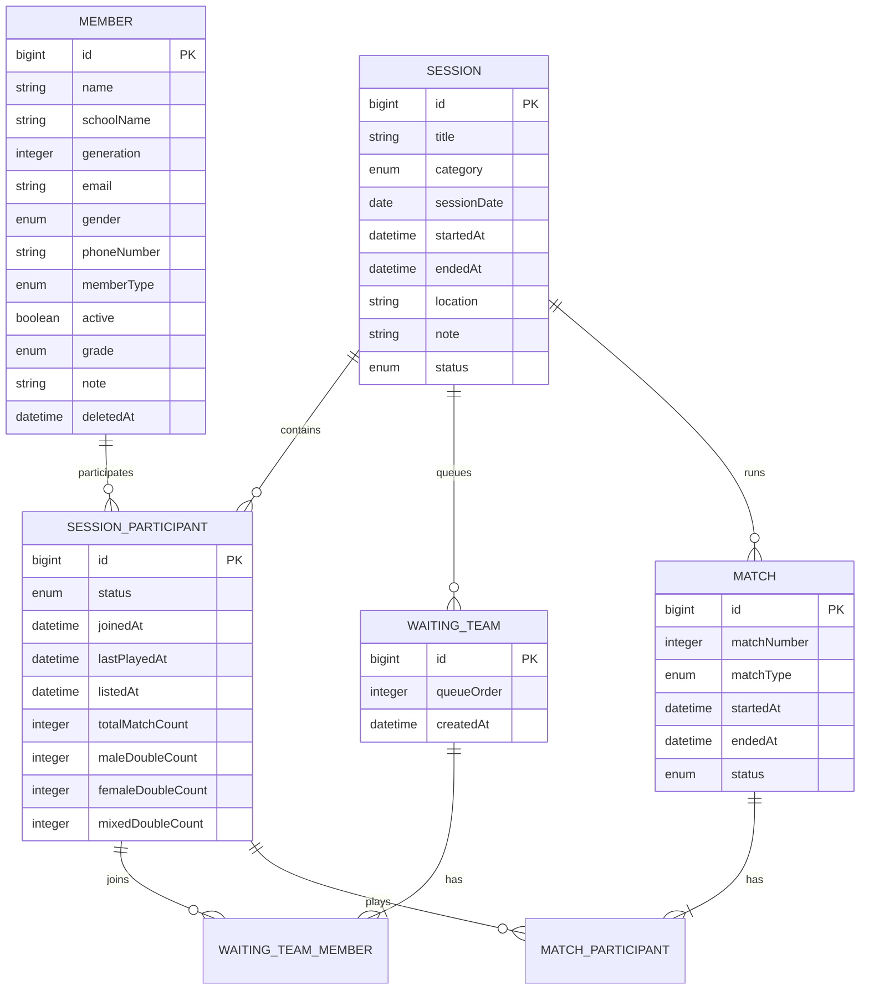

# PLAYCOCK 데이터 모델

## 엔티티 관계

운영 사용자 `User`는 현재 회원이나 세션 엔티티와 직접 연결되지 않고 인증·권한을 독립적으로 담당합니다.

## 엔티티별 책임

### User

서비스 운영 계정을 저장합니다.

- 이메일과 BCrypt 해시 비밀번호
- 이름
- `USER`·`MANAGER`·`ADMIN` 역할
- `PENDING`·`ACTIVE`·`INACTIVE`·`SUSPENDED` 상태
- 생성·수정·삭제 시각

### Member

여러 세션에 걸쳐 유지되는 동아리 회원 원장입니다.

- 이름, 학교, 기수, 연락처
- 성별과 급수
- 정회원·게스트·기타 구분
- 활동 여부와 운영 메모
- 생성·수정·삭제 시각

### Session

하루의 운동 운영 단위입니다.

- 정기 또는 번개 운동 구분
- 날짜, 장소, 제목과 메모
- 시작·종료 시각
- 진행 또는 종료 상태

### SessionParticipant

`Member`와 `Session` 사이에서 해당 세션만의 운영 상태를 보관합니다.

- 참가·마지막 경기·명단 복귀 시각
- 명단·대기 팀·경기·제외 상태
- 해당 세션의 전체 경기 수
- 남자·여자·혼합 복식별 경기 수

### WaitingTeam과 WaitingTeamMember

경기를 기다리는 네 명의 참가자 묶음입니다. `WaitingTeam`은 세션 내 대기 순서와 생성 시각을 갖고, 연결 엔티티인 `WaitingTeamMember`가 참가자를 연결합니다.

팀을 취소하거나 경기를 시작하면 해당 대기 팀과 연결 데이터는 제거됩니다. 경기 시작 이후의 이력은 `Match`와 `MatchParticipant`가 담당합니다.

### Match와 MatchParticipant

실제로 시작한 경기를 나타냅니다.

- 세션 내 경기 번호
- 남자·여자·혼합 복식 유형
- 시작·종료 시각과 진행 상태
- 경기 참가자 연결

## 데이터 무결성 규칙

서비스 계층에서 다음 규칙을 검증합니다.

- 한 대기 팀은 중복되지 않은 정확히 네 명으로 구성
- 대기 팀 참가자는 모두 같은 세션의 `LISTED` 상태
- 경기 시작 시 네 명 모두 `WAITING` 상태
- 참가자 제외는 `LISTED` 상태에서만 허용
- 종료된 경기는 다시 종료할 수 없음
- 대기 팀이나 진행 중 경기가 있으면 세션 종료 불가
- 종료된 세션의 운영 상태 변경 불가

현재 여러 운영자가 동시에 같은 참가자를 선택하는 경우를 데이터베이스 수준에서 막는 잠금이나 유니크 제약은 충분히 구성되어 있지 않습니다. 트랜잭션 검증 사이의 경합까지 다루려면 별도 동시성 제어가 필요합니다.

## 시간 필드의 의미

| 필드 | 의미 |
| --- | --- |
| `joinedAt` | 회원이 해당 세션에 처음 참가한 시각 |
| `listedAt` | 현재 대기 명단에 들어온 기준 시각 |
| `lastPlayedAt` | 마지막 경기를 끝낸 시각 |
| `WaitingTeam.createdAt` | 대기 팀을 만든 시각 |
| `Match.startedAt` | 경기를 시작한 시각 |
| `Match.endedAt` | 경기를 종료한 시각 |

경기를 끝내고 명단으로 돌아오면 `listedAt`을 다시 설정합니다. 반면 대기 팀을 취소해 명단으로 돌아올 때는 기존 대기 기준 시각을 유지해, 운영자의 팀 취소 때문에 참가자의 순서가 불필요하게 뒤로 밀리지 않게 합니다.

## 물리 스키마와 마이그레이션 상태

`users`와 `members`는 엔티티에서 테이블명을 명시합니다. 나머지 엔티티는 JPA와 Hibernate의 물리 이름 규칙을 따르므로, 실제 테이블·컬럼명은 적용 프로필과 Hibernate 설정을 기준으로 확인해야 합니다.

현재 코드에는 Flyway 의존성과 운영 프로필 설정이 있지만 공개 저장소에는 migration SQL이 없습니다.

- `docker` 프로필: Flyway 비활성화, Hibernate `ddl-auto: update`
- `prod` 프로필: Flyway 활성화, Hibernate `ddl-auto: validate`

따라서 현재 저장소만으로 신규 운영 데이터베이스를 `prod` 프로필에서 완전히 재현할 수 있다고 보기는 어렵습니다. 스키마를 버전 관리하려면 현재 엔티티 기준의 초기 migration과 이후 변경 migration을 추가해야 합니다.

